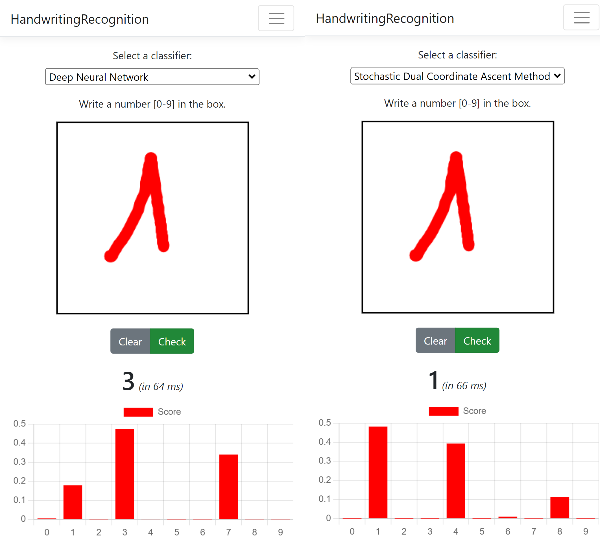
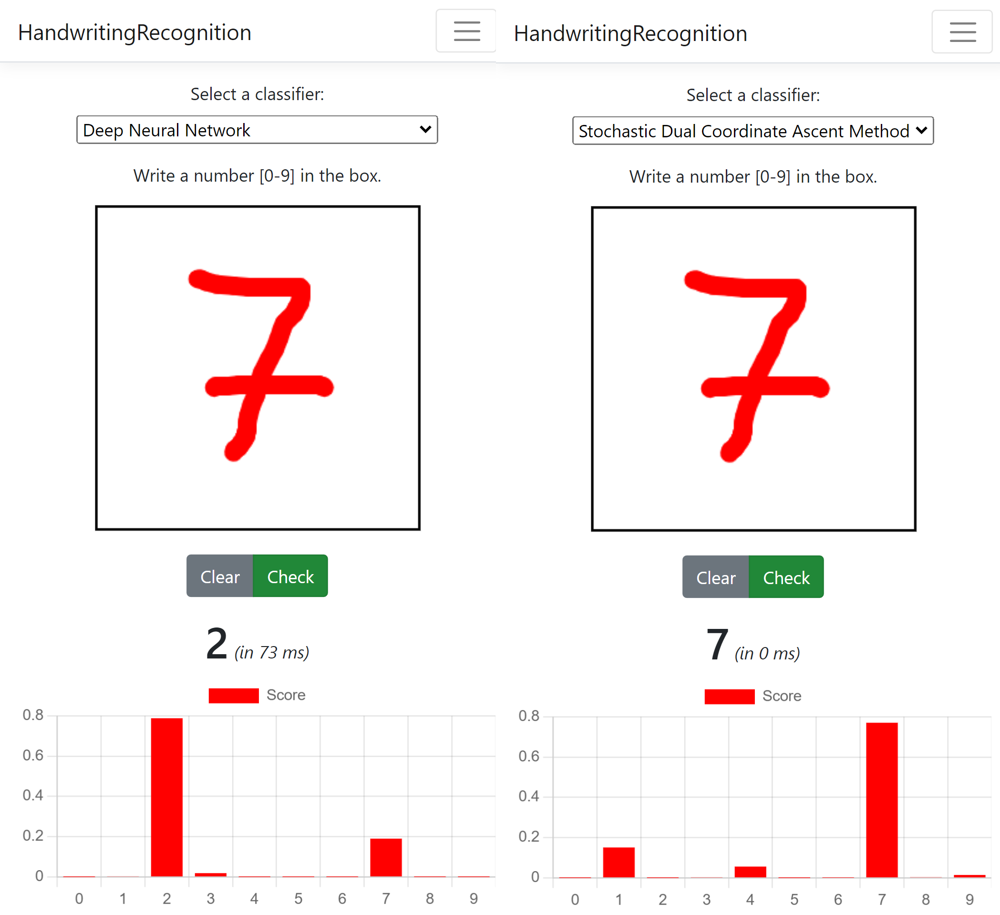

# Handwriting Recognition using ML.NET

This repo is based on three repositories below:

1. This repo is inspired by <https://github.com/dotnet-labs/HandwritingRecognition> I saw when I looked for many documents about OCR.

2. I created an image classifier model with MNIST dataset in JPG format. You can read more about the method at <https://github.com/dotnet/machinelearning-samples/tree/main/samples/csharp/getting-started/MulticlassClassification_MNIST>. However, I found that the results are not better than SDCA method with same image.

3. This is a multiclass classification model using SDCA (Stochastic Dual Coordinate Ascent) algorithm <https://github.com/dotnet/machinelearning-samples/tree/main/samples/csharp/getting-started/DeepLearning_ImageClassification_Training>.
